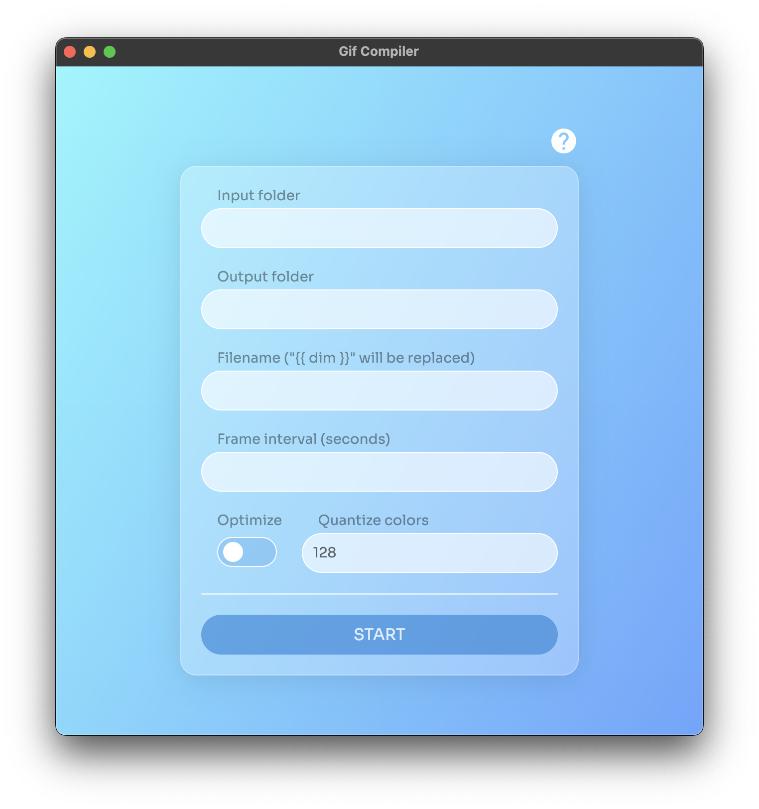

#  Gif Compiler

A simple Electron + React + Magick++ app to speedup creation of GIFs
- This was for the most part created as a favour for a friend to speed up their day to day workflow in a design agency

## Examples

Check out example results at: [./examples/results](https://github.com/dariodumlijan/gif-compiler/tree/main/examples/results)



## Directory structure
```sh
# -> Input folder
│
├── name_100x100_assets
│   │
│   ├── 1.jpg
│   └── 2.jpg
│
└── name_200x200_assets
    │
    ├── EN
    │   │
    │   ├── C01
    │   │   ├── 1.jpg
    │   │   └── 2.jpg
    │   │
    │   └── C02
    │       ├── 1.jpg
    │       └── 2.jpg
    │
    └── DE
        ├── C01
        │   ├── 1.jpg
        │   └── 2.jpg
        │
        └── C02
            ├── 1.jpg
            └── 2.jpg
```

## Project setup

No ENV variables required, just install node deps and run!
